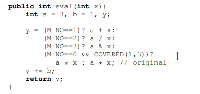
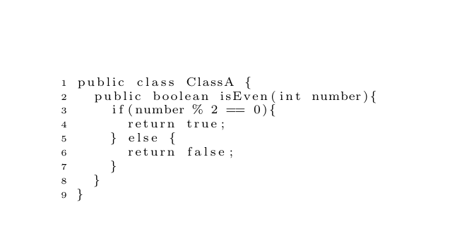
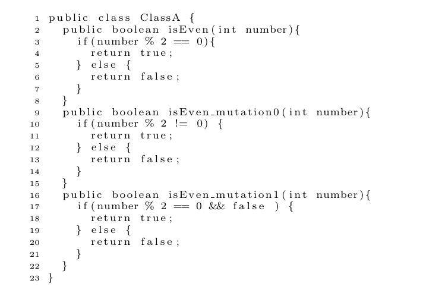
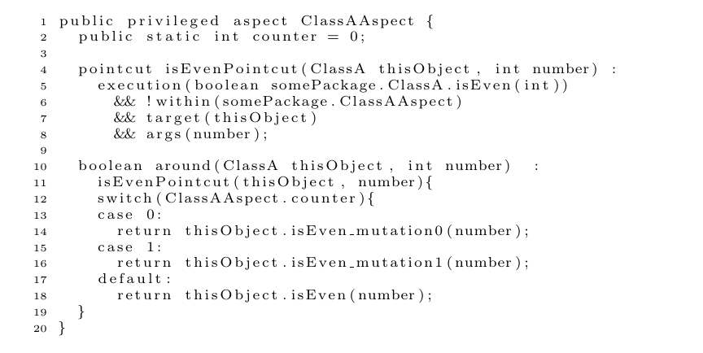
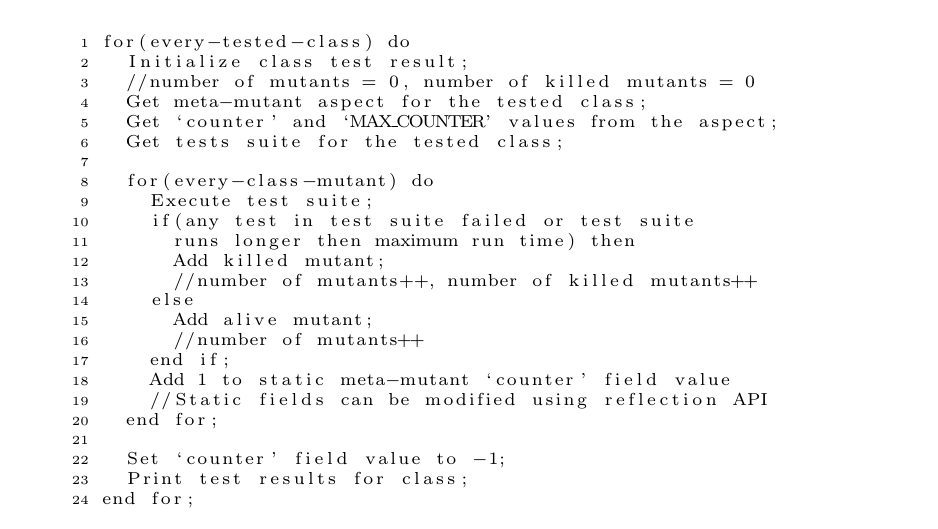

# Mutation Analysis 

Mutation testing is a fault based techniqe which helps to evaluate the performance of test suites. The effectiveness 
of test suites are measured by how many faults are detected. 

A mutated program is a replication of original program, which has a seeded fault. These faults are injected into
components on purpose and let the test suites detects those defects.

## Introduction

In this section, we will discuss the mutation analysis and conduct an experiment using different mutation analysis tools. 

This is a mutation analysis experiments. The tools are major mutation, mujava, judy and pit testing frameworks. 

PIT testing is a maven plugin, which is added in the project pom file, therefore, there is no a project related 
to PIT testing.

PIT testing is performed in logback-mutation workspace, which it is integrated into software development process.

This repository is a workspace for the other mutation testing frameworks as mentioned above. Since they are difficult to 
integrate in SDLC, we will try to find a way to execute test units using Apache Ant Build Framework.

## Related Works

- A Comparative analysis of Mutation Testing tools for Java
- A Comparison of Mutation Analysis Tools for Java
- A Study and Review on the Development of Mutation Testing Tools for Java and Aspect-J Programs
- Experimental Comparison of Automated Mutation Testing Tools for Java
- How Effective Mutation Testing Tools Are? An Empirical Analysis of Java Mutation Testing Tools with Manual 
  Analysis and Real Faults

## Background

The reader should have an understanding of unit testing development.
The reader also have a background of Java Programming Language, JUnit Framework.

### Selective Mutation
Mutation testing is expensive operation in terms of time and memory. The technique outputs many mutant version of
original component and requires them to be killed.  

## Tools

The tools which are used to perform experiments are MuJava, Judy, Major and PIT. These tools are freely available
and used frequently. In this study, we will focus on these tools.

### MuJava

Mujava (https://cs.gmu.edu/~offutt/mujava/) is one of the oldest mutation testing tools for Java language. This tool
are also the most used in most of the research studies. MuJava provides both method level and class level mutation 
analysis. It also supports that the OOP features. 

The process of mutation generation is as follows. Faults are injected into source files and result of injecting
creates a mutant that is the faulty version of original components.

### Major ( Mutation Analysis in a Java cOmpileR) 
Major is also a tool that is mostly used in studies. Major tool is integrated into the Java Compiler, therefore, it 
can be used in any Java-based environments. The process of generating mutant is that it manipulates the abstract
syntax tree of component which is going to be tested. It is also known as conditional mutation analysis tools.

MAJOR has a DSL support for specifying and adapting mutation operators. This makes Major extensible
for mutation operators. 

### Judy

Judy is an implementation of the FAMTA Light approach developed in Java with AspectJ extensions. 

pointcut and advice Aspect-Oriented Programming (AOP) mechanism

This approach takes
advantage of the pointcut and advice mechanism, which allows the definition of
special points in the program flow (during method execution, constructor invo-
cation and class field value change) – called pointcuts – and related methods –
called advices – that can be invoked before, after or instead of a defined point-
cut. The main strength of the mechanism is related to its support for regular
expressions, what enables the definition of similar behaviour for specific types
of event. This introduces very effective solutions to some commonly known pro-
gramming issues, called “cross-cutting concerns”, such as logging or transaction
management

### PIT

## Experiment

In this section, we will perform experiments for four different mutation testing tools. We will show performance of
each tools and compare them. These tools are used in open source logging framework called logback 
(https://github.com/qos-ch/logback). This framework is available open source and there are quite enough number of 
test case written manually by author. Therefore, It is an ideal candiate to perform mutation testing. 

There are steps to run mutation analysis for each mutation tools. Some of them has own compiler, own set of tools 
to generate mutants successfully. 
    
- PIT 

    We will firstly experiment using PIT testing tools. 

## Comparison of Tools    

number of mutants generated (Total number of mutants)
number of killed mutants
type of mutation generation technique : byte code , source code
mutation generation speeds

## Conclusion
