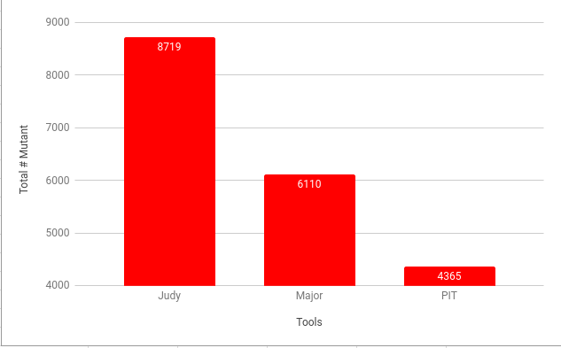
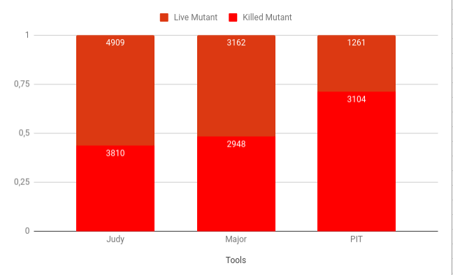
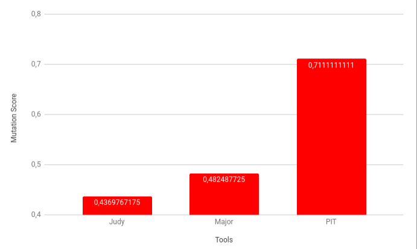

# Mutation Testing and Analysis with different Java Mutation Tools

## Introduction

Mutation testing is a fault based technique which helps to evaluate the performance of test suites. The effectiveness 
of test suites are measured by how many faults are detected. 

## Related Works

- A Comparative analysis of Mutation Testing tools for Java
- A Comparison of Mutation Analysis Tools for Java
- How Effective Mutation Testing Tools Are? An Empirical Analysis of Java Mutation Testing Tools with Manual 
  Analysis and Real Faults

## Tools

The tools which are used to perform experiments are  Judy, Major and PIT. These tools are freely available
and used frequently. In this study, we will focus on these tools.

### Major ( Mutation Analysis in a Java cOmpileR) 
Major is also a tool that is mostly used in studies. Major tool is integrated into the Java Compiler, therefore, it 
can be used in any Java-based environments. The process of generating mutant is that it manipulates the abstract
syntax tree of component which is going to be tested. It is also known as conditional mutation analysis tools.

MAJOR has a DSL support for specifying and adapting mutation operators. This makes Major extensible
for mutation operators. 

### Judy

Judy is an implementation of the FAMTA Light approach developed in Java with AspectJ extensions. 

## Experiment Result

